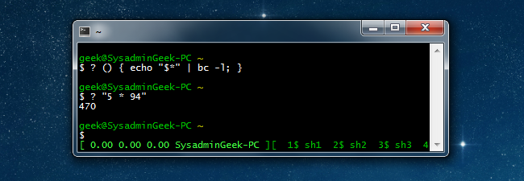

# Project 1: Terminal Calculator

## Project Overview
In this project, you will create a terminal-based calculator program in Go. The calculator
will support basic arithmetic operations such as 

- addition, 
- subtraction, 
- multiplication,
- division, and
- modulus

along with a menu-based interface. The goal is to apply the concepts you've learned so far, including:

- Variables and Data Types
- User Input
- Arithmetic Operations
- Control Flow

Important to note is that the program must run more than one operation. The program should not exit after
the first operation.

> **Additional Challenge**
> 
> - Add the `History` option to the options that can be selected
> - Call the `History` functions provided
> - Display the results
> ---